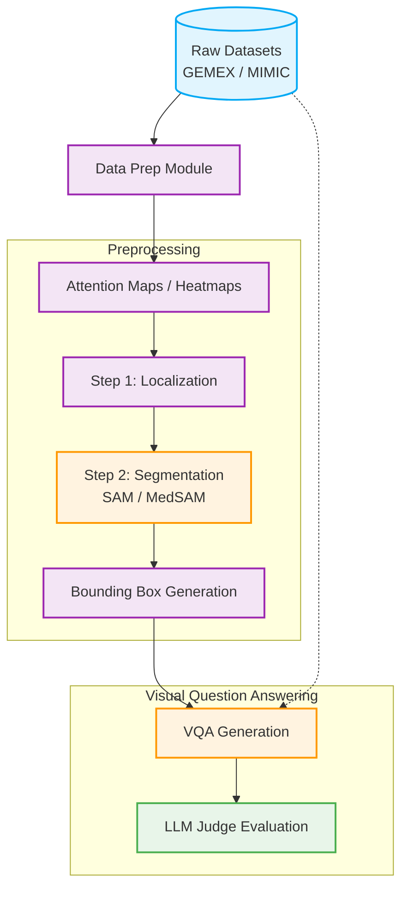

# 🏥 Pipeline VQA: Medical Visual Question Answering Framework

[](https://www.python.org/downloads/)
[](https://www.docker.com/)
[](#)
[](https://opensource.org/licenses/MIT)
[](https://GitHub.com/Naereen/StrapDown.js/graphs/commit-activity)

**Pipeline VQA** is a comprehensive, modular framework designed for automated Medical Visual Question Answering (VQA). This repository handles end-to-end processing of medical imaging datasets (like MIMIC-CXR and GEMEX), from raw data preparation and attention heatmap generation to precise image segmentation, bounding box extraction, and ultimately, VQA generation and automated evaluation via an LLM Judge.

## 📑 Table of Contents
- [Architecture](#-architecture)
- [Repository Structure](#-repository-structure)
- [Key Features](#-key-features)
- [Installation & Setup](#-installation--setup)
- [Usage](#-usage)
  - [Running the Orchestrator](#running-the-orchestrator)
  - [Running Individual Modules](#running-individual-modules)
- [Experiments & Benchmarks](#-experiments--benchmarks)
- [License](#-license)

---

## 🏗 Architecture

The pipeline is composed of highly decoupled modules, communicating via shared file structures and orchestrated seamlessly. Below is the data flow:



---

## 🗂 Repository Structure

```text
pipeline-vqa/
└── Thesis/
    ├── data_prep/         # Data preparation scripts for GEMEX and MIMIC-CXR
    ├── preprocessing/     # Core computer vision pipeline
    │   ├── attention_map/ # Heatmap generation from attention weights
    │   ├── bounding_box/  # BBox extraction and intersection metrics
    │   └── segmentation/  # Localization and MedSAM/SAM-based segmentation
    ├── vqa/               # Generative AI components
    │   ├── src/           # VQA generation and LLM judge evaluation logic
    │   └── tests/         # Integration and E2E error handling tests
    ├── orchestrator/      # High-level pipeline controller
    └── experiments/       # Large-scale gridsearch configurations & benchmark reports

```

---

## ✨ Key Features

* **End-to-End Orchestration**: A single orchestrator script allows you to run the entire pipeline seamlessly using bash and python sub-processes.
* **Modular Preprocessing**:
* Generates robust attention heatmaps.
* Localizes regions of interest.
* Performs zero-shot and fine-tuned segmentation using **SAM / MedSAM3**.


* **Automated Bounding Boxes**: Gridsearch configurations allow tuning of bounding box extraction thresholds, CRF integration, and region exploding/compositing.
* **Advanced VQA Generation**: Ties extracted image features to text via state-of-the-art vision-language models.
* **LLM as a Judge**: Evaluates VQA outputs systematically against ground-truth/gold-standard datasets using an LLM Judge, minimizing the need for manual grading.
* **Dockerized Environments**: Specific `Dockerfile`s (e.g., `Dockerfile.3090`, `Dockerfile.5090`, `Dockerfile.eval`) ensure dependency isolation and hardware-specific optimization.

---

## ⚙️ Installation & Setup

1. **Clone the repository:**
```bash
git clone [https://github.com/your-username/pipeline-vqa.git](https://github.com/your-username/pipeline-vqa.git)
cd pipeline-vqa/Thesis

```


2. **Build the Docker Images:**
We recommend running modules using Docker to avoid dependency conflicts. Navigate to the module you want to run and execute its build script:
```bash
cd preprocessing/segmentation
./scripts/build_image.sh
# Or for specific GPUs: ./scripts/build_image_MedSAM3.sh

```


3. **Install Local Requirements (if running locally):**
```bash
pip install -r preprocessing/attention_map/docker/requirements.txt
# Repeat for other submodules as needed

```


---

## 🚀 Usage

### Running the Orchestrator

To run the full end-to-end pipeline automatically:

```bash
cd orchestrator
./run_orchestrator.sh

```

*Note: Ensure your configuration paths inside the orchestrator match your local dataset mounts.*

### Running Individual Modules

You can easily trigger individual components using the provided Slurm/Bash submit scripts:

* **Data Preparation**: `python data_prep/prepare_gemex.py`
* **Heatmaps**: `./preprocessing/attention_map/submit_heatmap_gen.sh`
* **Segmentation**: `./preprocessing/segmentation/submit_segmentation.sh`
* **Bounding Boxes**: `./preprocessing/bounding_box/submit_bbox_preprocessing.sh`
* **VQA & LLM Judge**: `./vqa/submit_generation.sh` && `./vqa/scripts/run_judge.sh`

---

## 📊 Experiments & Benchmarks

The repository includes a comprehensive `experiments/01_bbox_gridsearch` directory capable of generating massive amounts of benchmark configurations (varying thresholds, loose/smart padding, CRF integration).

You can find the aggregated markdown reports here:

* `BENCHMARK_V1_SUMMARY.md`
* `BENCHMARK_V2_SUMMARY.md`

To generate a new grid of configs:

```bash
cd experiments/01_bbox_gridsearch
python generate_grid_configs.py
./submit_benchmark.sh

```

---

## 📜 License

This project is licensed under the [MIT License](https://www.google.com/search?q=LICENSE). Please see the https://www.google.com/search?q=LICENSE file for details.
