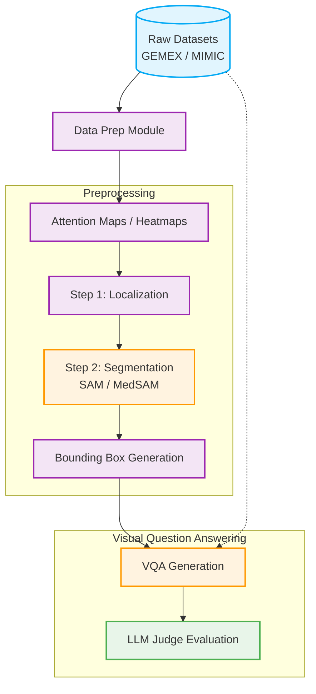

# 🏥 Pipeline VQA: Medical Visual Question Answering Framework

[](https://www.python.org/downloads/)
[](https://www.docker.com/)
[](#)
[](https://wandb.ai)
[](https://opensource.org/licenses/MIT)
[](https://GitHub.com/Naereen/StrapDown.js/graphs/commit-activity)

**Pipeline VQA** is a comprehensive, modular framework designed for automated Medical Visual Question Answering (VQA). This repository handles end-to-end processing of medical imaging datasets (like MIMIC-CXR and GEMEX), from raw data preparation and attention heatmap generation to precise image segmentation, bounding box extraction, and ultimately, VQA generation and automated evaluation via an LLM Judge.

## 📑 Table of Contents
- [Architecture](#-architecture)
- [Repository Structure](#-repository-structure)
- [Key Features](#-key-features)
- [Installation & Setup](#-installation--setup)
- [Usage](#-usage)
  - [Running the Orchestrator](#running-the-orchestrator)
  - [Running Individual Modules](#running-individual-modules)
- [Intelligent Prompt Injection](#-intelligent-prompt-injection)
- [Experiments & Benchmarks](#-experiments--benchmarks)
- [License](#-license)

---

## 🏗 Architecture

The pipeline is composed of highly decoupled modules, communicating via shared file structures and orchestrated seamlessly. Below is the data flow:


```mermaid
graph TD
    %% Define styles
    classDef data fill:#e1f5fe,stroke:#03a9f4,stroke-width:2px;
    classDef process fill:#f3e5f5,stroke:#9c27b0,stroke-width:2px;
    classDef model fill:#fff3e0,stroke:#ff9800,stroke-width:2px;
    classDef eval fill:#e8f5e9,stroke:#4caf50,stroke-width:2px;

    %% Nodes
    A[(Raw Datasets\nGEMEX / MIMIC)]:::data
    B[Data Prep Module]:::process
    
    subgraph Preprocessing
        C[Attention Maps / Heatmaps]:::process
        D[Step 1: Localization]:::process
        E[Step 2: Segmentation\nSAM / MedSAM]:::model
        F[Bounding Box Generation]:::process
    end
    
    subgraph Visual Question Answering
        G[VQA Generation]:::model
        H[LLM Judge Evaluation]:::eval
    end
    
    %% Connections
    A --> B
    B --> C
    C --> D
    D --> E
    E --> F
    F --> G
    A -.-> G
    G --> H
    
    %% Labels
    click E "[https://github.com/bowang-lab/MedSAM](https://github.com/bowang-lab/MedSAM)" "MedSAM Integration"

```

### Agentic Query Expansion / Routing (Optional Middleware)

The pipeline includes an optional **NLP middleware stage** (`medclip_routing`) that intercepts the raw dataset before visual preprocessing. When enabled via the orchestrator, it:

1. **Evaluates query quality** using SciSpacy clinical entity extraction (CPU). Queries with fewer than 2 clinical entities or fewer than 5 words are flagged as "brief".
2. **Expands brief queries** using Gemma-2-2B-it (GPU, ~5GB VRAM), rewriting them into detailed clinical prompts suitable for downstream vision models.
3. **Outputs an enriched JSONL dataset** (`expanded_queries.jsonl`) with the `question` column overwritten by expanded text, preserving the original in `original_question`.

The enriched dataset is automatically bridged to the next preprocessing stage via the `ROUTED_DATASET_OVERRIDE` environment variable. This architecture isolates NLP models (Gemma) from vision models (BiomedCLIP/MedSAM) across sequential GPU execution steps, preventing OOM issues on the RTX 3090 (24GB).

```
                             ROUTED_DATASET_OVERRIDE          DATA_FILE_OVERRIDE
 Raw Dataset ──> [Routing] ─────────────────────────> [Preprocessing] ──────────────> [VQA Gen] ──> [Judge]
                 (NLP only)                            (Vision only)
                 SciSpacy + Gemma                      BBox / Attn / Seg
```

If routing is **not** selected in the orchestrator, preprocessing stages fall back to their default dataset configuration with zero changes required.

---

## 🗂 Repository Structure

```text
pipeline-vqa/
├── data_prep/                  <-- DATA ENGINEERING
│   ├── prepare_gemex.py        # Dataset preparation scripts
│   └── ...
│
├── preprocessing/              <-- THE ENGINE (Core Logic)
│   ├── attention_map/          # Heatmap generation logic
│   ├── segmentation/           # MedSAM (2/3) segmentation logic
│   ├── medclip_routing/        # NLP query expansion middleware (SciSpacy + Gemma)
│   └── bounding_box/           # Bounding Box generation & evaluation
│       ├── src/                # Source code
│       ├── configs/            # Configuration files (.conf)
│       └── scripts/            # Submission scripts
│
├── vqa/                        <-- THE INTELLIGENCE (VQA Logic)
│   ├── src/                    # Core VQA generation & LLM Judge
│   ├── configs/                # Configuration files (e.g., medgemma_1_5.conf)
│   └── scripts/                # Execution & Evaluation scripts
│
├── orchestrator/               <-- THE INTERFACE (Pipeline Manager)
│   ├── orchestrator.py         # Main CLI: stage selection, config discovery, SLURM chaining
│   └── slurm_templates.py      # sbatch template generation (e.g. VQA Judge wrapper)
│
├── experiments/                <-- THE LAB (Experiment Tracking)
│   ├── 01_bbox_gridsearch/     # Grid Search tracking & configs
│   └── ...                     # Future experiments
│
├── archive_results.py          # Results archiving & cleanup utility
├── clean_results.sh            # Legacy cleanup script
├── run_orchestrator.sh         # Root-level launcher (venv bootstrap + CLI entry point)
├── build_all_images.sh         # Recursive Docker build script (Project-Wide)
│
└── orchestrator_runs/          # Auto-generated run directories (gitignored)

```

---

## ✨ Key Features

* **End-to-End Orchestration**: A single orchestrator script allows you to run the entire pipeline seamlessly using bash and python sub-processes.
* **Modular Preprocessing**:
  * Generates robust attention heatmaps.
  * Localizes regions of interest.
  * Performs zero-shot and fine-tuned segmentation using **SAM / MedSAM3**.
  * **Automatic VQA integration** via manifest generation (`vqa_manifest.csv`).
* **Automated Bounding Boxes**: Gridsearch configurations allow tuning of bounding box extraction thresholds, CRF integration, and region exploding/compositing.
* **Agentic Query Expansion**: Optional NLP middleware that evaluates query quality with SciSpacy and expands brief queries using Gemma-2-2B-it before visual preprocessing, improving downstream VQA quality.
* **Preprocessing→VQA Bridge**: The orchestrator automatically detects routing→preprocessing and preprocessing→VQA chains and configures data flow via environment variable injection (`ROUTED_DATASET_OVERRIDE`, `DATA_FILE_OVERRIDE`, `PREPROC_TYPE`).
* **Intelligent Prompt Injection**: The VQA generation prompt is automatically enriched with visual context describing what preprocessing was applied (heatmap attention weights, bounding boxes, or segmentation masks), helping the LLM correctly interpret visual artifacts in the image. Baseline runs receive no injection and are unaffected.
* **Unified Experiment Tracking (WandB)**: All preprocessing stages log to the single `GEMeX-VQA-Pipeline` WandB project. Orchestrator runs automatically group all stages under a shared WandB run group (`run_YYYYMMDD_HHMMSS`), enabling cross-stage comparison, final summary metrics (`success_rate`, `throughput_img_per_sec`), and artifact lineage tracking for key outputs.
* **Advanced VQA Generation**: Ties extracted image features to text via state-of-the-art vision-language models (MedGemma, Qwen2-VL, etc.).
* **LLM as a Judge**: Evaluates VQA outputs systematically against ground-truth/gold-standard datasets using an LLM Judge, minimizing the need for manual grading.
* **Dockerized Environments**: Specific `Dockerfile`s (e.g., `Dockerfile.3090`, `Dockerfile.5090`, `Dockerfile.eval`) ensure dependency isolation and hardware-specific optimization.

---

## ⚙️ Installation & Setup

1. **Clone the repository:**
```bash
git clone [https://github.com/your-username/pipeline-vqa.git](https://github.com/your-username/pipeline-vqa.git)
cd pipeline-vqa/Thesis

```


2. **Build the Docker Images:**
We recommend running modules using Docker to avoid dependency conflicts.

**Option A: Build All Images (Recommended)**
```bash
# From the Thesis/ root directory:
./build_all_images.sh
# Automatically discovers and builds all Docker images in the project

```

**Option B: Build Individual Modules**
Navigate to the module you want to run and execute its build script:
```bash
cd preprocessing/segmentation
./scripts/build_image.sh
# Or for specific GPUs: ./scripts/build_image_MedSAM3.sh

```


3. **Install Local Requirements (if running locally):**
```bash
pip install -r preprocessing/attention_map/docker/requirements.txt
# Repeat for other submodules as needed

```


---

## 🚀 Usage

### Running the Orchestrator

To run the full end-to-end pipeline automatically:

```bash
cd orchestrator
./run_orchestrator.sh

```

*Note: Ensure your configuration paths inside the orchestrator match your local dataset mounts.*

### Running Individual Modules

You can easily trigger individual components using the provided Slurm/Bash submit scripts:

* **Data Preparation**: `python data_prep/prepare_gemex.py`
* **Heatmaps**: `./preprocessing/attention_map/submit_heatmap_gen.sh`
* **Segmentation**: `./preprocessing/segmentation/submit_segmentation.sh`
* **Bounding Boxes**: `./preprocessing/bounding_box/submit_bbox_preprocessing.sh`
* **VQA & LLM Judge**: `./vqa/submit_generation.sh` && `./vqa/scripts/run_judge.sh`

---

## 💡 Intelligent Prompt Injection

When a preprocessing stage runs before VQA generation, the LLM receives the preprocessed image (containing overlaid heatmaps, bounding boxes, or segmentation masks) but has no context about what those visual artifacts represent. The **Intelligent Prompt Injection** system solves this by automatically enriching the VQA prompt with a description of the preprocessing applied.

### How It Works

The injection propagates through the pipeline via a single environment variable (`PREPROC_TYPE`) that flows from the orchestrator bridge into the Docker container and then into the Python generation script.

```
[Orchestrator Bridge]         [Docker Host]             [Container]           [generate_vqa.py]
_generate_preprocessing_  →  submit_generation.sh  →  run_generation.sh  →  prepare_chat_
to_vqa_bridge()              -e PREPROC_TYPE="..."    --preproc_type $VAR     conversations()
export PREPROC_TYPE=                                                          PREPROC_CONTEXT[type]
  "{stage_key}"                                                               + prompt_template
```

The injection is a **prefix** prepended to the existing prompt template. The core question, few-shot examples, and formatting instructions remain completely intact. In **baseline mode** (no preprocessing stage selected), `PREPROC_TYPE` is empty and nothing is injected.

### Injected Context by Preprocessing Type

| Stage Key | `PREPROC_TYPE` | Visual Artifact | Injected Context |
|---|---|---|---|
| `attn_map` | `attn_map` | Heatmap overlay | Explains that hotter colors (red/yellow) are high-attention regions; cooler colors (blue) are low-attention |
| `bbox_preproc` | `bbox_preproc` | Bounding boxes | States that regions of interest are enclosed in **red/fuchsia bounding boxes** |
| `segmentation` | `segmentation` | Segmentation mask | States that segmented structures are highlighted in **green** and enclosed by an **azure bounding box** |
| *(none)* | *(empty)* | Original image | No injection — baseline prompt used as-is |

### Injected Text (Full)

**Attention Map (`attn_map`):**
```
**Visual Context:** This image contains a heatmap overlay representing Attention Weights
from a visual model. Higher intensity areas (hotter colors such as red and yellow) indicate
regions where the model focused its visual processing, highlighting areas of clinical saliency.
Cooler colors (blue) indicate lower attention. Use these attention cues to guide your analysis.
```

**Bounding Box (`bbox_preproc`):**
```
**Visual Context:** Specific regions of interest in this image have been localized. The relevant
findings or objects are enclosed in **red/fuchsia bounding boxes**. Focus your analysis on the
content within these bounding boxes, as they highlight the most clinically relevant areas.
```

**Segmentation (`segmentation`):**
```
**Visual Context:** This image features precise anatomical or pathological segmentation. The
segmented areas of interest are highlighted in **green**, and are further encapsulated by an
**azure (light blue) bounding box**. Focus your analysis on the segmented regions, as they
delineate the clinically relevant structures.
```

### Standalone Usage

The preprocessing type can also be set manually when running VQA generation outside the orchestrator:

```bash
# Injecting bounding box context manually
python3 src/generate_vqa.py \
  --model_name google/medgemma-4b-it \
  --data_file results/vqa_manifest.csv \
  --preproc_type bbox_preproc \
  ...
```

Or via the config/env variable when using the shell wrapper:
```bash
PREPROC_TYPE=attn_map ./submit_generation.sh configs/generation/medgemma_4b.conf
```

---

## 📊 Experiments & Benchmarks

The repository includes a comprehensive `experiments/01_bbox_gridsearch` directory capable of generating massive amounts of benchmark configurations (varying thresholds, loose/smart padding, CRF integration).

You can find the aggregated markdown reports here:

* `BENCHMARK_V1_SUMMARY.md`
* `BENCHMARK_V2_SUMMARY.md`

To generate a new grid of configs:

```bash
cd experiments/01_bbox_gridsearch
python generate_grid_configs.py
./submit_benchmark.sh

```

---

## 📜 License

This project is licensed under the [MIT License](https://www.google.com/search?q=LICENSE). Please see the https://www.google.com/search?q=LICENSE file for details.
