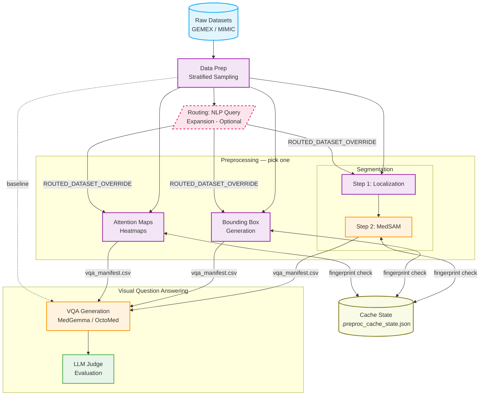

# 🏥 Pipeline VQA: Medical Visual Question Answering Framework

[](https://www.python.org/downloads/)
[](https://www.docker.com/)
[](#)
[](https://wandb.ai)
[](https://opensource.org/licenses/MIT)
[](https://GitHub.com/Naereen/StrapDown.js/graphs/commit-activity)

**Pipeline VQA** is a comprehensive, modular framework designed for automated Medical Visual Question Answering (VQA). This repository handles end-to-end processing of medical imaging datasets (like MIMIC-CXR and GEMEX), from raw data preparation and attention heatmap generation to precise image segmentation, bounding box extraction, and ultimately, VQA generation and automated evaluation via an LLM Judge.

## 📑 Table of Contents
- [Architecture](#-architecture)
- [Repository Structure](#-repository-structure)
- [Key Features](#-key-features)
- [Installation & Setup](#-installation--setup)
- [Usage](#-usage)
  - [Running the Orchestrator](#running-the-orchestrator)
  - [Batch Experiment Generation](#batch-experiment-generation)
  - [Running Individual Modules](#running-individual-modules)
- [Intelligent Prompt Injection](#-intelligent-prompt-injection)
- [Preprocessing Cache](#-preprocessing-cache)
- [Experiments & Benchmarks](#-experiments--benchmarks)
- [License](#-license)

---

## 🏗 Architecture

The pipeline is composed of highly decoupled modules communicating via shared file structures and orchestrated seamlessly. Preprocessing stages are **mutually exclusive alternatives** — you select one per run. Below is the full data flow:


```mermaid
graph TD
    %% Define styles
    classDef data fill:#e1f5fe,stroke:#03a9f4,stroke-width:2px;
    classDef process fill:#f3e5f5,stroke:#9c27b0,stroke-width:2px;
    classDef model fill:#fff3e0,stroke:#ff9800,stroke-width:2px;
    classDef eval fill:#e8f5e9,stroke:#4caf50,stroke-width:2px;
    classDef optional fill:#fce4ec,stroke:#e91e63,stroke-width:2px,stroke-dasharray:5 5;
    classDef cache fill:#f9fbe7,stroke:#827717,stroke-width:2px;

    %% Nodes
    A[(Raw Datasets\nGEMEX / MIMIC)]:::data
    B[Data Prep\nStratified Sampling]:::process
    R[/Routing: NLP Query\nExpansion - Optional/]:::optional

    subgraph Preprocessing [Preprocessing — pick one]
        C[Attention Maps\nHeatmaps]:::process
        F[Bounding Box\nGeneration]:::process
        subgraph Seg [Segmentation]
            D[Step 1: Localization]:::process
            E[Step 2: MedSAM]:::model
        end
    end

    K[(Cache State\n.preproc_cache_state.json)]:::cache

    subgraph VQA [Visual Question Answering]
        G[VQA Generation\nMedGemma / OctoMed]:::model
        H[LLM Judge\nEvaluation]:::eval
    end

    %% Connections
    A --> B
    B --> R
    B -.->|baseline| G
    R -->|ROUTED_DATASET_OVERRIDE| C & F & D
    B --> C & F & D
    D --> E
    C -->|vqa_manifest.csv| G
    F -->|vqa_manifest.csv| G
    E -->|vqa_manifest.csv| G
    C & F & E <-->|fingerprint check| K
    G --> H
```

### Agentic Query Expansion / Routing (Optional Middleware)

The pipeline includes an optional **NLP middleware stage** (`medclip_routing`) that intercepts the raw dataset before visual preprocessing. When enabled via the orchestrator, it:

1. **Evaluates query quality** using SciSpacy clinical entity extraction (CPU). Queries with fewer than 2 clinical entities or fewer than 5 words are flagged as "brief".
2. **Expands brief queries** using Gemma-2-2B-it (GPU, ~5GB VRAM), rewriting them into detailed clinical prompts suitable for downstream vision models.
3. **Outputs an enriched JSONL dataset** (`expanded_queries.jsonl`) with the `question` column overwritten by expanded text, preserving the original in `original_question`.

The enriched dataset is automatically bridged to the next preprocessing stage via the `ROUTED_DATASET_OVERRIDE` environment variable. This architecture isolates NLP models (Gemma) from vision models (BiomedCLIP/MedSAM) across sequential GPU execution steps, preventing OOM issues on the RTX 3090 (24GB).

```
                             ROUTED_DATASET_OVERRIDE          DATA_FILE_OVERRIDE
 Raw Dataset ──> [Routing] ─────────────────────────> [Preprocessing] ──────────────> [VQA Gen] ──> [Judge]
                 (NLP only)                            (Vision only)
                 SciSpacy + Gemma                      BBox / Attn / Seg
```

If routing is **not** selected in the orchestrator, preprocessing stages fall back to their default dataset configuration with zero changes required.

---

## 🗂 Repository Structure

```text
pipeline-vqa/
├── data_prep/                      <-- DATA ENGINEERING
│   ├── prepare_gemex.py            # GEMeX dataset preparation
│   ├── prepare_mimic_ext.py        # MIMIC-Ext dataset preparation
│   ├── create_stratified_samples.py# Stratified random sampling (distributes to all modules)
│   ├── utils.py                    # Centralized file distribution utility
│   └── generated_datasets_registry.json  # Tracks all distributed CSV files
│
├── preprocessing/                  <-- THE ENGINE (Core Logic)
│   ├── attention_map/              # Heatmap / attention map generation
│   ├── segmentation/               # MedSAM segmentation (Step 1: localization, Step 2: SAM)
│   ├── medclip_routing/            # NLP query expansion middleware (SciSpacy + Gemma)
│   └── bounding_box/               # GradCAM bounding box generation & evaluation
│       ├── src/                    # Source code
│       ├── configs/                # Configuration files (.conf)
│       └── scripts/                # Submission scripts
│
├── vqa/                            <-- THE INTELLIGENCE (VQA Logic)
│   ├── src/                        # Core VQA generation & LLM Judge
│   ├── configs/
│   │   ├── generation/             # medgemma_1_5.conf, medgemma_4b.conf, octomed_7b.conf, ...
│   │   └── judge/                  # hard_coded_judge.conf
│   └── scripts/                    # Execution & evaluation scripts
│
├── orchestrator/                   <-- THE INTERFACE (Pipeline Manager)
│   ├── orchestrator.py             # Interactive CLI: stage selection, config discovery, SLURM chaining
│   ├── slurm_templates.py          # Meta-job sbatch generation, inter-stage bridges, cache blocks
│   └── cache_utils.py              # Preprocessing cache state management (check / write / validate)
│
├── experiments/                    <-- THE LAB (Experiment Tracking)
│   ├── 01_bbox_gridsearch/         # Grid search tracking & configs
│   ├── batch_2k/                   # 2K stratified sample batch (5 experiments)
│   │   ├── generate_experiments.py # Generates all meta-job scripts for the batch
│   │   ├── submit_all.sh           # Submits all 5 jobs with sequential SLURM dependencies
│   │   └── exp_*/meta_job.sh       # Per-experiment sbatch scripts
│   └── ...
│
├── archive_results.py              # Moves distributed results into the orchestrator run directory
├── run_orchestrator.sh             # Root-level launcher (auto-bootstraps venv, runs CLI)
├── build_all_images.sh             # Recursive Docker build script (project-wide)
│
└── orchestrator_runs/              # Auto-generated run directories (gitignored)
```

---

## ✨ Key Features

* **End-to-End Orchestration**: A single interactive CLI (`run_orchestrator.sh`) lets you compose any pipeline combination — dataset, preprocessing stage, VQA model, and judge — and submits it as a single SLURM meta-job with continuous GPU ownership.
* **Modular Preprocessing** (select one per run):
  * Generates robust GradCAM attention heatmaps (`attn_map`).
  * Performs GradCAM-based bounding box localization (`bbox_preproc`).
  * Performs zero-shot / fine-tuned segmentation using **MedSAM** (`segmentation`, internal 2-step pipeline).
  * **Automatic VQA integration** via manifest generation (`vqa_manifest.csv`).
* **Intelligent Preprocessing Cache**: A fingerprint-based cache system (`cache_utils.py`) tracks dataset, config hash, and NER status per preprocessing stage. Identical runs are automatically skipped; NER configuration changes invalidate and re-compute stale results. See [Preprocessing Cache](#-preprocessing-cache).
* **Agentic Query Expansion**: Optional NLP middleware that evaluates query quality with SciSpacy and expands brief queries using Gemma-2-2B-it before visual preprocessing, improving downstream VQA quality.
* **Preprocessing→VQA Bridge**: The orchestrator automatically detects routing→preprocessing and preprocessing→VQA chains and configures data flow via environment variable injection (`ROUTED_DATASET_OVERRIDE`, `DATA_FILE_OVERRIDE`, `PREPROC_TYPE`).
* **Intelligent Prompt Injection**: The VQA generation prompt is automatically enriched with visual context describing what preprocessing was applied (heatmap attention weights, bounding boxes, or segmentation masks), helping the LLM correctly interpret visual artifacts in the image. Baseline runs receive no injection and are unaffected.
* **Unified Experiment Tracking (WandB)**: All preprocessing stages log to the single `GEMeX-VQA-Pipeline` WandB project. Orchestrator runs automatically group all stages under a shared WandB run group, enabling cross-stage comparison, final summary metrics (`success_rate`, `throughput_img_per_sec`), and artifact lineage tracking.
* **Batch Experiment Generation**: The `experiments/batch_2k/generate_experiments.py` pattern allows generating multiple pre-configured meta-job scripts in one go, with a single `submit_all.sh` to chain them via SLURM dependencies.
* **Advanced VQA Generation**: Ties extracted image features to text via state-of-the-art vision-language models (`medgemma_1_5`, `medgemma_4b`, `octomed_7b`).
* **LLM as a Judge**: Evaluates VQA outputs systematically against ground-truth datasets using Qwen2.5-7B-Instruct, minimizing the need for manual grading.
* **Dockerized Environments**: Separate Docker images per module (`bbox_preprocessing:3090`, `heatmap_gen:3090`, `medclip_routing:3090`, `med_vqa_project:3090`) ensure dependency isolation and hardware-specific optimization for the RTX 3090.

---

## ⚙️ Installation & Setup

1. **Clone the repository:**
```bash
git clone https://github.com/your-username/pipeline-vqa.git
cd pipeline-vqa/Thesis
```

2. **Build the Docker Images:**

**Option A: Build All Images (Recommended)**
```bash
# From the Thesis/ root directory:
./build_all_images.sh
# Automatically discovers and builds all Docker images in the project
```

**Option B: Build Individual Modules**
```bash
cd preprocessing/segmentation
./scripts/build_image.sh
# Or for MedSAM3: ./scripts/build_image_MedSAM3.sh
```

3. **Orchestrator dependencies** are bootstrapped automatically on first run (no manual `pip install` needed). The launcher creates a minimal `.orchestrator_env/` venv with only `rich` and `inquirer`.

---

## 🚀 Usage

### Running the Orchestrator

To run the full end-to-end pipeline interactively from the project root:

```bash
./run_orchestrator.sh
# Dry-run mode (generates script without submitting):
./run_orchestrator.sh --dry-run
```

The CLI will prompt you to:
1. **Select a dataset** — any `.csv` in `preprocessing/bounding_box/` (includes stratified samples)
2. **Select stages** — any combination of routing, preprocessing, VQA generation, and judge
3. **Configure each stage** — pick a `.conf` file or use the module default
4. **Confirm and submit** — generates a single meta-job and submits it via `sbatch`

All stages in a run share a SLURM allocation (single GPU, 15h limit) and are grouped under one WandB run group.

### Batch Experiment Generation

For running multiple experiments with different preprocessing / VQA model combinations, use the batch generator pattern:

```bash
# 1. Generate a stratified dataset (distributes to all modules automatically)
cd data_prep
python3 create_stratified_samples.py --limit 2000 --report

# 2. Generate all meta-job scripts
cd ..
python3 experiments/batch_2k/generate_experiments.py

# 3a. Submit all sequentially (chained SLURM dependencies)
bash experiments/batch_2k/submit_all.sh

# 3b. Or submit individually
sbatch experiments/batch_2k/exp_01_bbox_medgemma15/meta_job.sh
sbatch experiments/batch_2k/exp_02_bbox_medgemma4b/meta_job.sh
```

The cache system ensures that experiments sharing the same preprocessing configuration (e.g., three different VQA models on the same BBox run) only compute preprocessing once.

### Running Individual Modules

You can trigger individual components directly via their submit scripts (from the project root):

* **Data Preparation**: `python3 data_prep/create_stratified_samples.py --limit N`
* **Heatmaps**: `sbatch preprocessing/attention_map/submit_heatmap_gen.sh [config.conf]`
* **Segmentation**: `sbatch preprocessing/segmentation/submit_segmentation.sh [step1.conf step2.conf]`
* **Bounding Boxes**: `sbatch preprocessing/bounding_box/submit_bbox_preprocessing.sh [config.conf]`
* **VQA Generation**: `sbatch vqa/submit_generation.sh [config.conf]`
* **LLM Judge**: `sbatch vqa/scripts/run_judge.sh [config.conf]`

---

## 💡 Intelligent Prompt Injection

When a preprocessing stage runs before VQA generation, the LLM receives the preprocessed image (containing overlaid heatmaps, bounding boxes, or segmentation masks) but has no context about what those visual artifacts represent. The **Intelligent Prompt Injection** system solves this by automatically enriching the VQA prompt with a description of the preprocessing applied.

### How It Works

The injection propagates through the pipeline via a single environment variable (`PREPROC_TYPE`) set by the orchestrator bridge.

```
[Orchestrator Bridge]         [Docker Host]             [Container]           [generate_vqa.py]
_generate_preprocessing_  →  submit_generation.sh  →  run_generation.sh  →  prepare_chat_
to_vqa_bridge()              -e PREPROC_TYPE="..."    --preproc_type $VAR     conversations()
export PREPROC_TYPE=                                                          PREPROC_CONTEXT[type]
  "{stage_key}"                                                               + prompt_template
```

The injection is a **prefix** prepended to the existing prompt template. The core question, few-shot examples, and formatting instructions remain completely intact. In **baseline mode** (no preprocessing stage selected), `PREPROC_TYPE` is empty and nothing is injected.

### Injected Context by Preprocessing Type

| Stage Key | `PREPROC_TYPE` | Visual Artifact | Injected Context |
|---|---|---|---|
| `attn_map` | `attn_map` | Heatmap overlay | Explains that hotter colors (red/yellow) are high-attention regions; cooler colors (blue) are low-attention |
| `bbox_preproc` | `bbox_preproc` | Bounding boxes | States that regions of interest are enclosed in **red/fuchsia bounding boxes** |
| `segmentation` | `segmentation` | Segmentation mask | States that segmented structures are highlighted in **green** and enclosed by an **azure bounding box** |
| *(none)* | *(empty)* | Original image | No injection — baseline prompt used as-is |

### Injected Text (Full)

**Attention Map (`attn_map`):**
```
**Visual Context:** This image contains a heatmap overlay representing Attention Weights
from a visual model. Higher intensity areas (hotter colors such as red and yellow) indicate
regions where the model focused its visual processing, highlighting areas of clinical saliency.
Cooler colors (blue) indicate lower attention. Use these attention cues to guide your analysis.
```

**Bounding Box (`bbox_preproc`):**
```
**Visual Context:** Specific regions of interest in this image have been localized. The relevant
findings or objects are enclosed in **red/fuchsia bounding boxes**. Focus your analysis on the
content within these bounding boxes, as they highlight the most clinically relevant areas.
```

**Segmentation (`segmentation`):**
```
**Visual Context:** This image features precise anatomical or pathological segmentation. The
segmented areas of interest are highlighted in **green**, and are further encapsulated by an
**azure (light blue) bounding box**. Focus your analysis on the segmented regions, as they
delineate the clinically relevant structures.
```

### Standalone Usage

```bash
# Inject bounding box context manually
PREPROC_TYPE=bbox_preproc ./vqa/submit_generation.sh configs/generation/medgemma_4b.conf
```

---

## 🗃 Preprocessing Cache

The cache system avoids re-running expensive GPU preprocessing when the inputs haven't changed. It is implemented in `orchestrator/cache_utils.py` and is automatically injected by `slurm_templates.py` into every meta-job script for preprocessing stages.

### Fingerprint Components

Each preprocessing stage writes a `.preproc_cache_state.json` into its `results/` directory after successful completion:

```json
{
  "dataset": "mimic_ext_stratified_2000_samples.csv",
  "config_hash": "a3f2b1c4...",
  "config_file": "configs/gemex/exp_01_vqa.conf",
  "ner_enabled": false,
  "output_row_count": 2000,
  "manifest_exists": true,
  "timestamp": "2026-02-25T14:30:00"
}
```

### Decision Logic

| Condition | Action |
|---|---|
| No state file | **Run** stage |
| Dataset filename changed | **Run** stage |
| Config file MD5 changed | **Run** stage |
| NER enabled/disabled mismatch | **Wipe** `results/*` + **Run** stage |
| `vqa_manifest.csv` missing or empty | **Run** stage |
| All match | **Skip** stage, reuse existing results |

### NER-Aware Invalidation

If a run with NER enabled follows one without (or vice versa), the cache detects the mismatch and automatically cleans the stale results directory before re-running, preventing data contamination between enriched and non-enriched queries.

### Cache CLI

```bash
# Check cache validity (exit 0 = hit, exit 1 = miss)
python3 orchestrator/cache_utils.py check \
    --results-dir preprocessing/bounding_box/results \
    --dataset mimic_ext_stratified_2000_samples.csv \
    --config-file preprocessing/bounding_box/configs/gemex/exp_01_vqa.conf

# Write state after a successful stage
python3 orchestrator/cache_utils.py write --results-dir ... --dataset ... --config-file ...

# Validate integrity of cached results
python3 orchestrator/cache_utils.py validate --results-dir preprocessing/bounding_box/results
```

---

## 📊 Experiments & Benchmarks

### BBox Grid Search

The `experiments/01_bbox_gridsearch/` directory contains configurations for large-scale hyperparameter sweeps (CAM threshold, CRF integration, padding strategies).

```bash
cd experiments/01_bbox_gridsearch
python generate_grid_configs.py
./submit_benchmark.sh
```

Aggregated reports: `BENCHMARK_V1_SUMMARY.md`, `BENCHMARK_V2_SUMMARY.md`

### Batch Multi-Model Experiments

The `experiments/batch_2k/` directory provides a template for running multiple preprocessing × VQA model combinations on a fixed stratified dataset, with automatic caching of shared preprocessing steps.

```bash
# Regenerate scripts (e.g. after changing configs)
python3 experiments/batch_2k/generate_experiments.py

# Submit all with SLURM dependencies
bash experiments/batch_2k/submit_all.sh
```

Current batch (2K stratified dataset):

| Exp | Preprocessing | VQA Model | Cache |
|-----|--------------|-----------|-------|
| 01 | BBox `exp_01_vqa.conf` | MedGemma 1.5 4B | runs |
| 02 | BBox `exp_01_vqa.conf` | MedGemma 4B | **hit** |
| 03 | BBox `exp_01_vqa.conf` | OctoMed 7B | **hit** |
| 04 | Segmentation (MedSAM) | MedGemma 1.5 4B | runs |
| 05 | Attention Map | OctoMed 7B | runs |

---

## 📜 License

This project is licensed under the [MIT License](LICENSE).
