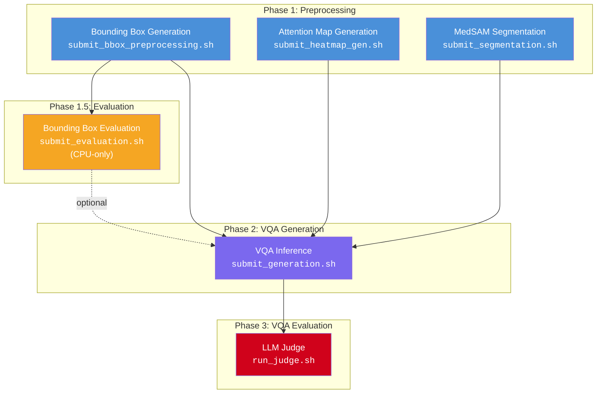
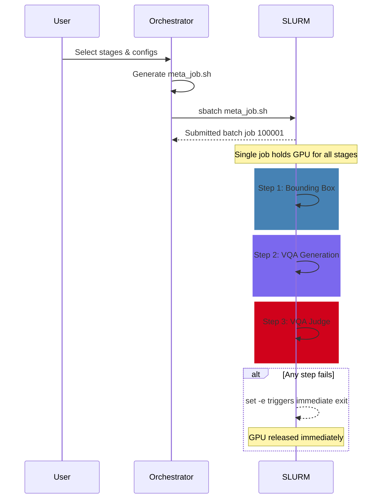
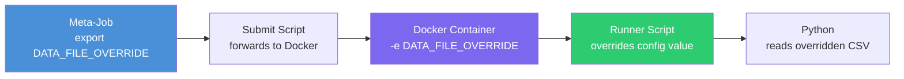

# Pipeline Orchestrator

Interactive CLI tool for chaining Medical VQA pipeline stages and submitting them to the SLURM cluster as a **single meta-job** with continuous GPU ownership.

## Quick Start

```bash
# From the Thesis/ root directory:

# Dry run (generates script without submitting)
./run_orchestrator.sh --dry-run

# Live submission
./run_orchestrator.sh
```

On first run, the wrapper script creates a lightweight virtual environment (`.orchestrator_env/`) and installs the required dependencies (`rich`, `inquirer`). Subsequent runs reuse the existing environment.

## Pipeline Overview

The orchestrator manages six pipeline stages across three phases. Each stage maps to an existing submit script and its associated configuration files.



> **Note:** The diagram above shows logical data dependencies. The orchestrator runs all selected stages **sequentially within a single SLURM job** (meta-job), ensuring continuous GPU ownership without re-entering the queue between steps.

## Architecture: Single Meta-Job

Instead of submitting separate SLURM jobs with dependency chaining, the orchestrator generates a **single bash script** (`meta_job.sh`) that runs all selected stages in sequence:



**Key benefits:**
- **Continuous GPU ownership** — the GPU is allocated once and held for the entire pipeline, eliminating queue wait times between stages
- **Fail-fast** — `set -e` ensures that if any stage fails, the script exits immediately, releasing the GPU
- **15-hour time limit** — SLURM automatically terminates and releases resources if the pipeline exceeds the limit
- **Full traceability** — the generated script, SLURM logs, and report are all saved to the run directory

## How It Works

### 0. Dataset Selection (Global Override)

The first prompt lets you choose a dataset CSV that will be used by **all stages** in the run, overriding whatever is hardcoded in individual config files. This is the primary mechanism for controlling which data the entire pipeline operates on.

```
? Select Dataset for this run
  > (Use Script Defaults)
    gemex_VQA_mimic_mapped.csv
    my_custom_dataset.csv
```

Selecting a dataset sets the `DATA_FILE_OVERRIDE` environment variable, which is exported at the top of the meta-job and propagates through the full chain:



| Stage | Override Variable | Where Override Happens |
|-------|------------------|----------------------|
| Bounding Box | `METADATA_FILENAME` | Runner script (host, before Docker) |
| Attention Map | `METADATA_FILENAME` | Runner script (host, before Docker) |
| Segmentation | `METADATA_FILE` | `run_pipeline.sh` (inside Docker via `-e`) |
| VQA Generation | `DATA_FILE` | `run_generation.sh` (inside Docker via `-e`) |
| VQA Judge | N/A | Does not consume CSV (reads JSON from generation output) |

Choosing **(Use Script Defaults)** skips the override entirely, letting each stage use whatever its config file specifies.

### 1. Stage Selection

The CLI presents a checkbox menu listing all available stages. Select any combination using `SPACE` to toggle and `ENTER` to confirm. Stages are always executed in pipeline order regardless of selection order.

```
? Select pipeline stages (SPACE to toggle, ENTER to confirm)
  [ ] Preprocessing: Bounding Box - GradCAM-based bounding box generation
  [ ] Preprocessing: Attention Map - Heatmap/attention map generation
  [ ] Preprocessing: Segmentation - MedSAM segmentation pipeline
  [ ] Bounding Box Evaluation - IoU metrics evaluation (CPU-only)
  [ ] VQA Generation - LLM-based VQA inference
  [ ] VQA Evaluation (Judge) - LLM Judge evaluation
```

### 2. Configuration

For each selected stage, the orchestrator automatically discovers all `.conf` files in the stage's config directory and presents them for selection:

```
--- Configuring: VQA Generation ---
? Select config for VQA Generation
  > (default - no config argument)
    hard_coded_gen.conf
    local_test.conf
```

**Special cases:**

| Stage | Configuration Method |
|-------|---------------------|
| Segmentation | Prompts for `TARGET_MODE` (all/1/2) and optional sample `LIMIT` — passed as environment variables |
| Bounding Box Evaluation | Prompts for predictions directory and output metrics directory — passed as positional arguments |
| VQA Judge | Docker command is inlined in the meta-job since the stage only has a runner script (`run_judge.sh`), not a submit script |

### 3. Review & Confirm

Before submission, a summary table is displayed for review:

```
        Pipeline Summary (Single Meta-Job)
┌──────┬───────────────────────────┬─────────────────────────────┐
│ Step │ Stage                     │ Config / Args               │
├──────┼───────────────────────────┼─────────────────────────────┤
│  1   │ Preprocessing: Bbox       │ configs/gemex/exp_01.conf   │
│  2   │ VQA Generation            │ configs/generation/local.conf│
│  3   │ VQA Evaluation (Judge)    │ configs/judge/hard_coded.conf│
└──────┴───────────────────────────┴─────────────────────────────┘

All stages will run sequentially in a single SLURM job (15h time limit).

? Proceed with submission? (Y/n)
```

### 4. Meta-Job Execution

The orchestrator generates a single `meta_job.sh` script and submits it via `sbatch`. The generated script:

1. Requests GPU resources once (`--gpus=nvidia_geforce_rtx_3090:1`)
2. Sets up global environment variables (`DATA_FILE_OVERRIDE`, `ORCH_OUTPUT_DIR`)
3. Enables fail-fast mode (`set -e`)
4. Installs an EXIT trap for failure/timeout reporting
5. Runs each stage sequentially by calling its submit script via `bash`

Each step logs timestamps for start and completion:

```
[2026-02-15 14:30:22] START: 1 - Preprocessing: Bounding Box
...
[2026-02-15 15:12:45] DONE:  1 - Preprocessing: Bounding Box
[2026-02-15 15:12:45] START: 2 - VQA Generation
...
```

**Error handling:**
- If any stage exits with a non-zero code, `set -e` terminates the script immediately
- The EXIT trap logs which step failed and the exit code
- If the job exceeds 15 hours, SLURM sends SIGTERM, triggering the same trap
- In all cases, the GPU is released promptly

**Preprocessing→VQA Bridge:**
When a preprocessing stage (bbox, attention_map, or segmentation) is followed by VQA generation, the orchestrator automatically:
1. Detects the preprocessing output directory
2. Verifies the existence of `vqa_manifest.csv`
3. Injects environment variables:
   - `DATA_FILE_OVERRIDE` → Path to the manifest
   - `VQA_IMAGE_PATH` → Path to the preprocessing output directory
4. The VQA submission script uses these variables to:
   - Mount the preprocessing output as `/preprocessed_images:ro` in Docker
   - Override the default dataset with the manifest

This enables seamless data flow without manual configuration — the VQA model automatically consumes the preprocessed images instead of the original dataset.

### 5. Run Isolation & Reporting

Each invocation creates an isolated run directory:

```
orchestrator_runs/
  run_20260215_143022/
    meta_job.sh                         # The generated sbatch script
    slurm_metajob_100001.out            # SLURM stdout
    slurm_metajob_100001.err            # SLURM stderr
    report.txt                          # Summary with Job ID and configs
    step_01_bbox_preproc/
      config_used.txt                   # Records which config was selected
    step_02_vqa_gen/
      config_used.txt
    step_03_vqa_judge/
      config_used.txt
```

The `report.txt` provides a permanent record of the run:

```
============================================================
Pipeline Orchestrator Run Report
============================================================
Timestamp : 2026-02-15 14:30:22
Run Dir   : /home/user/Thesis/orchestrator_runs/run_20260215_143022
Job ID    : 100001
Dry Run   : False
Dataset   : gemex_VQA_mimic_mapped.csv

------------------------------------------------------------
Step   Stage                          Config
------------------------------------------------------------
1      Preprocessing: Bounding Box    configs/gemex/exp_01.conf
2      VQA Generation                 configs/generation/local.conf
3      VQA Evaluation (Judge)         configs/judge/hard_coded.conf

============================================================
```

## Preprocessing→VQA Bridge Mode

The orchestrator implements automatic data flow integration when preprocessing and VQA stages are chained together.

### How It Works

When you select both a preprocessing stage and VQA generation:

```
Selected: [✓] Bounding Box  [✓] VQA Generation
```

The orchestrator automatically:

1. **Detects the bridge pattern** after preprocessing stage completes
2. **Validates** the existence of `vqa_manifest.csv` in the preprocessing output directory
3. **Injects environment variables** before VQA execution:
   ```bash
   export DATA_FILE_OVERRIDE="/path/to/preprocessing/results/vqa_manifest.csv"
   export VQA_IMAGE_PATH="/path/to/preprocessing/results"
   ```
4. **The VQA stage** automatically:
   - Reads the manifest instead of the default dataset CSV
   - Mounts the preprocessing output directory as `/preprocessed_images:ro`
   - Uses the preprocessed images (bounding boxes, heatmaps, or segmentation overlays)

### Supported Bridges

| Preprocessing Stage | Output Images | VQA Receives |
|---------------------|---------------|--------------|
| Bounding Box | `files/*.jpg` (cropped regions) | Bounding box images with visual markers |
| Attention Map | `files/*.png` (heatmap overlays) | Attention heatmap overlay images |
| Segmentation | `overlays/*.png` (segmentation overlays) | Segmentation mask overlays |

### Example Pipeline

```
1. Preprocessing: Bounding Box → generates vqa_manifest.csv + bbox images
   ↓ (orchestrator detects bridge)
2. VQA Generation → automatically uses bbox images instead of original dataset
```

**No manual configuration required** — the orchestrator handles all path resolution and Docker mounting automatically.

---

## Stage Reference

| Stage | Script | Config Directory | GPU | Notes |
|-------|--------|-----------------|-----|-------|
| Bounding Box | `preprocessing/bounding_box/submit_bbox_preprocessing.sh` | `preprocessing/bounding_box/configs/` | Yes | Accepts config file as `$1`, generates `vqa_manifest.csv` |
| Attention Map | `preprocessing/attention_map/submit_heatmap_gen.sh` | `preprocessing/attention_map/configs/` | Yes | Accepts config file as `$1`, generates `vqa_manifest.csv` |
| Segmentation | `preprocessing/segmentation/submit_segmentation.sh` | `preprocessing/segmentation/configs/` | Yes | Uses env vars: `TARGET_MODE`, `LIMIT`, generates `vqa_manifest.csv` |
| Bbox Evaluation | `preprocessing/bounding_box/submit_evaluation.sh` | N/A | No | Positional args: predictions dir, output dir |
| VQA Generation | `vqa/submit_generation.sh` | `vqa/configs/generation/` | Yes | Accepts config file as `$1`, supports bridge mode |
| VQA Judge | `vqa/scripts/run_judge.sh` | `vqa/configs/judge/` | Yes | Docker command inlined in meta-job |

## File Structure

```
Thesis/
├── run_orchestrator.sh              # Entry point (venv bootstrap + launcher)
└── orchestrator/
    ├── orchestrator.py              # Core CLI logic
    ├── slurm_templates.py           # Meta-job & judge template generation
    └── README.md                    # This file
```

## Cluster Constraints

All jobs are pinned to the `faretra` node via `#SBATCH -w faretra` due to dataset locality. The meta-job requests GPU resources once and holds them for the entire pipeline run (up to 15 hours).
