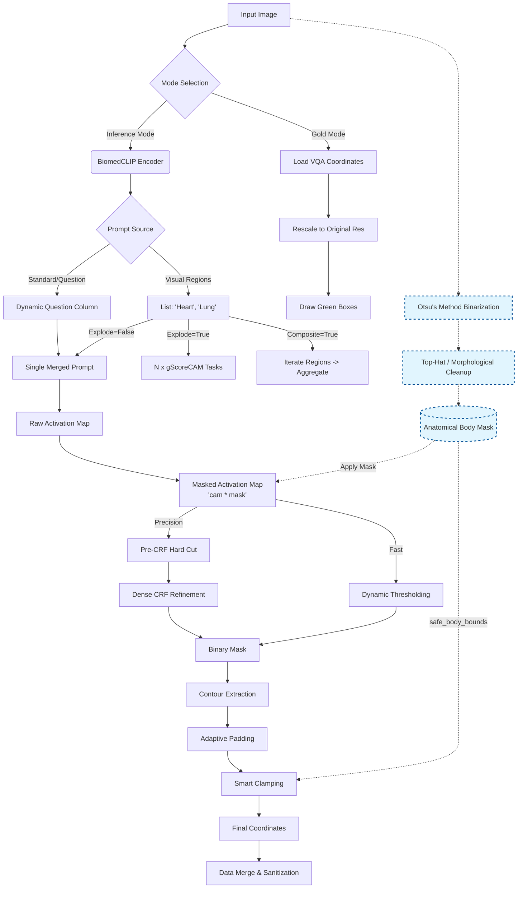

# Medical Weakly-Supervised Bounding Box Generation

This project implements a **Weakly-Supervised Object Localization (WSOL)** pipeline for medical images (Chest X-Rays). It leverages **BiomedCLIP** to align visual features with text prompts and uses **gScoreCAM** to generate precise bounding boxes without needing pixel-level annotations.

It incorporates advanced **Anatomical Filtering**, **Adaptive Padding**, and **Safety Mechanisms** to handle the noise typical of medical imaging (e.g., labels, wires, dark background).

Designed for HPC environments (UniboNLP Cluster) managed by **Slurm**.

---

## 🏗 Architecture

The pipeline uses a **Configuration Injection** pattern to manage different experimental setups without code duplication. It offers execution paths for both **Inference** (Standard, Question-Driven, Composite) and **Gold Standard Visualization**.

It includes a robust **3-Layer Filtering System** applied before and after box generation:



---

## 📂 Project Structure

The project logic is encapsulated in `scripts/`, while configurations and data preparation tools are modularized.

```text
.
├── configs/                      # Experiment Configurations
│   ├── gemex/                    # GEMeX Dataset Experiments (Thesis Core)
│   │   ├── exp_01_vqa.conf       # E1: Baseline (Blind)
│   │   ├── exp_02_vqa.conf       # E2: Silver Standard (High Precision)
│   │   ├── exp_03_vqa.conf       # E3: Clinical VQA (Standard)
│   │   ├── exp_04_vqa.conf       # E4: Hybrid Context (Composite)
│   │   ├── exp_05_vqa.conf       # E5: Small Nodule Discovery (High Recall)
│   │   ├── exp_06_vqa.conf       # E6: Anatomical Atlas (Validation)
│   │   ├── exp_07_vqa.conf       # E7: Context-Aware Inference
│   │   └── exp_08_vqa.conf       # E8: Fast Scout (Speed/Stress Test)
│   └── mimic_ext/                # MIMIC-Ext Experiments
│       └── exp_01_vqa_mimic.conf # Large Scale Inference (No GT)
├── prepare_datasets/             # Data Ingestion & Mapping Scripts
│   ├── prepare_gemex_vqa.py      # Downloader/Mapper for GEMeX
│   ├── prepare_gemex.py          # Alternative mapper
│   └── prepare_mimic_ext.py      # Adapter for MIMIC-Ext (Text-Only)
├── scripts/                      # Core Logic & Containers
│   ├── bbox_preprocessing.py     # Main Pipeline Logic
│   ├── utils.py                  # CAM Wrappers & Helpers
│   ├── run_bbox_preprocessing.sh # Docker Runtime Wrapper
│   ├── Dockerfile.3090           # Environment Definition
│   └── requirements.txt          # Python Dependencies
├── submit_bbox_preprocessing.sh  # Slurm Entry Point
└── README.md

```

---

## 🛠 Data Preparation

Before launching the pipeline, you must generate the mapping CSV files that link metadata to the physical image paths on the cluster.

### 1. GEMeX Dataset (Evaluation)

This is the primary dataset for the thesis, containing Ground Truth bounding boxes.

```bash
python3 prepare_datasets/prepare_gemex.py
# Output: ../gemex_mimic_mapped.csv

```

### 2. MIMIC-Ext-CXR-VQA (Inference Only)

This dataset provides a massive scale of VQA pairs but lacks bounding box annotations in the cluster version. Used for qualitative inference analysis.

```bash
python3 prepare_datasets/prepare_mimic_ext.py
# Output: ../mimic_ext_mapped.csv

```

> **Note:** The script automatically handles path correction (prepending `files/`) to match the cluster storage structure.

---

## 🧪 Experimental Setup

Select one of the pre-defined configurations in `configs/`.

### GEMeX Dataset (Thesis Core)

| ID | Experiment Name | Description | Key Strategy | Config File |
| --- | --- | --- | --- | --- |
| **E1** | **Baseline** | Generic anomaly detection. | Blind (No Question/Context). | `configs/gemex/exp_01_vqa.conf` |
| **E2** | **Silver Standard** | **High Precision**. Generates clean training data. | Dense CRF + Hard Cutoff (0.6) + Tight Padding. | `configs/gemex/exp_02_vqa.conf` |
| **E3** | **Clinical VQA** | **Standard**. Optimized for general clinical questions. | Adaptive Thresholds + Body Masking. | `configs/gemex/exp_03_vqa.conf` |
| **E4** | **Hybrid Context** | Fuses anatomy with prompts. | Composite Regions + Context Injection. | `configs/gemex/exp_04_vqa.conf` |
| **E5** | **Small Nodule** | **High Sensitivity**. Detects tiny lesions (nodules). | **No CRF** + Low Threshold + Large Context Padding. | `configs/gemex/exp_05_vqa.conf` |
| **E6** | **Anatomical Atlas** | Structural validation (Heart, Lungs, etc.). | Explodes region list into separate images. | `configs/gemex/exp_06_vqa.conf` |
| **E7** | **Context Aware** | Localized VQA. | Injects question text *into* the anatomical region prompt. | `configs/gemex/exp_07_vqa.conf` |
| **E8** | **Fast Scout** | Speed/Throughput benchmark. | **Disables** CRF, Smart Padding, and Ana-Checks. | `configs/gemex/exp_08_vqa.conf` |

### MIMIC-Ext Dataset (Inference Only)

| ID | Experiment Name | Description | Config File |
| --- | --- | --- | --- |
| **M1** | **Large Scale** | Text-Only VQA inference on 50k+ samples. | `configs/mimic_ext/exp_01_vqa_mimic.conf` |

---

## 🏃 Usage (Slurm)

To launch an experiment on the cluster:

1. **Open** `submit_bbox_preprocessing.sh`.
2. **Select** the target configuration by uncommenting the desired line inside the script (or passing it as an arg if supported):

```bash
# Inside submit_bbox_preprocessing.sh (via the wrapper call)
# Example:
TARGET_CONFIG="configs/gemex/exp_03_vqa.conf"

```

3. **Submit** the job:

```bash
sbatch submit_bbox_preprocessing.sh

```

The system will:

1. Check for the Docker image `bbox_preprocessing:3090`.
2. Automatically build it from `scripts/Dockerfile.3090` if missing.
3. Launch the container via `scripts/run_bbox_preprocessing.sh`.
4. Execute `scripts/bbox_preprocessing.py` with the selected config.

---

## ⚙️ Key Configuration Variables

These variables are defined in the `.conf` files.

### Prompting & Strategy

| Variable | Description |
| --- | --- |
| `USE_DYNAMIC_PROMPTS` | `true`: Uses the `question` column as prompt. |
| `USE_VISUAL_REGIONS` | `true`: Uses the list column (`visual_regions`) as prompts. |
| `EXPLODE_REGIONS` | `true`: Generates separate outputs for each region in the list. |
| `INCLUDE_CONTEXT` | `true`: Appends the question text to the anatomical region prompt. |

### Thresholds & Safety

| Variable | Description |
| --- | --- |
| `CAM_THRESHOLD` | Activation threshold (0.0-1.0). **>0.45** for precision, **<0.35** for recall. |
| `SKIP_CRF` | `true`: Disables Dense CRF. Faster and better for tiny objects. `false`: Smooths boundaries (Standard). |
| `CRF_CUTOFF` | Hard threshold applied *before* CRF refinement to remove noise (e.g., "0.6"). |
| `ENABLE_SMART_PADDING` | `true`: Clamps box expansion to the anatomical mask (Layer 3). |

---

## 🛡 Robustness & Troubleshooting

**1. "Images not found / Success: 0 (MIMIC-Ext)"**

* **Cause:** The JSON in MIMIC-Ext contains relative paths (e.g., `p10/...`) but the physical storage is `files/p10/...`.
* **Fix:** Ensure you ran the latest `prepare_datasets/prepare_mimic_ext.py` which fixes the paths in the CSV.

**2. "The box covers the entire lung/image (Giant Blob)"**

* **Cause:** Running in `COMPOSITE_REGIONS="true"` with a generic prompt or low threshold.
* **Fix:** Switch to **Experiment E3** which disables composite regions.

**3. "Small nodules are missing"**

* **Cause:** CRF smoothing or high thresholds are erasing small activations.
* **Fix:** Switch to **Small Nodule Discovery** config (`exp_05_vqa.conf`).

**4. "Disk Quota Exceeded"**

* **Fix:** Set `OUTPUT_FORMAT="jsonl"` in your config and clean the `results/` folder.

---

## 📊 Outputs

The pipeline generates the following outputs in the `results/` directory:

### Primary Outputs

| File | Format | Description |
|------|--------|-------------|
| `predictions.jsonl` | JSONL | Complete predictions with bounding box coordinates, prompts, and metadata |
| `vqa_manifest.csv` | CSV | VQA-ready manifest for downstream pipeline integration |
| `report.txt` | Text | Processing summary with success/failure statistics |

### VQA Manifest Structure

The `vqa_manifest.csv` file enables seamless integration with the VQA generation stage:

```csv
image_path,question,answer
files/p10/p10268877/s50042142/4c3c1335-0fce9b11-027c582b-a0ed8d89-ca614d90_idx1.jpg,What is the position of the ET tube as seen in the CXR?,C
files/p10/p10268877/s50042142/4c3c1335-0fce9b11-027c582b-a0ed8d89-ca614d90_idx2.jpg,What could be inferred from the NG tube's positioning as noted in the CXR?,NG tube tip is in the stomach.
```

**Key Features:**
- **Relative Paths:** Image paths are relative to the results directory
- **One Row Per Image:** Multi-region questions create multiple rows (one per bounding box)
- **Metadata Preservation:** Questions and answers copied exactly from source CSV
- **Orchestrator Compatible:** Automatically detected when chaining bbox → VQA in orchestrator

### Visual Outputs (Optional)

When `OUTPUT_FORMAT="image"`, the pipeline also generates:
- Bounding box overlay images (`.jpg`) in `files/` subdirectory
- Visual debugging images with box overlays

---

## 📜 Reproducibility

* **Hardware:** NVIDIA RTX 3090 (24GB VRAM).
* **MIMIC-CXR Mount:** Read-Only (`:ro`) to ensure data integrity.
* **Base Image:** `nvidia/cuda:12.2.0-devel` with `TORCH_CUDA_ARCH_LIST="8.6"`.
