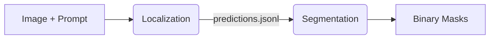

# Medical Segmentation Pipeline (BiomedCLIP + MedSAM / MedSAM2 / MedSAM3)

This project implements an end-to-end **Weakly-Supervised Segmentation** pipeline for medical images (Chest X-Rays). It generates pixel-perfect masks starting from text prompts, using a two-step approach.

**Key Components:**
1.  **Step 1 (Localization):** **BiomedCLIP** + **gScoreCAM** → Bounding Boxes.
2.  **Step 2 (Segmentation):** **MedSAM**, **MedSAM2**, or **MedSAM3** → Precise Masks.

Designed for the **UniboNLP Cluster** (Slurm + Rootless Docker).

---

## 🏗 Architecture



### Supported Scenarios (Step 2 — SAM1/SAM2)
-   **Scenario A (Clean):** Standard bbox-prompted inference.
-   **Scenario B (Visual Prompting):** Red Box drawn on image pixels.
-   **Scenario C (Adversarial):** Red Box drawn, but prompt coordinates shifted.

---

## 🤖 Supported Models

All models are **automatically downloaded** on first use and cached in `checkpoints/`.

### SAM1 / MedSAM (Bounding Box Prompts)
| Key | Model | Dockerfile |
|---|---|---|
| `medsam` | MedSAM ViT-B (default) | `Dockerfile.3090` |
| `vit_b` / `vit_l` / `vit_h` | SAM ViT variants | `Dockerfile.3090` |

### MedSAM2 — SAM 2.1 Based (Bounding Box Prompts)
| Key | Model | Dockerfile |
|---|---|---|
| `medsam2_latest` | MedSAM2 Latest (**recommended**) | `Dockerfile.3090` |
| `medsam2_2411` | MedSAM2 Nov 2024 (Base) | `Dockerfile.3090` |
| `medsam2_us_heart` | Heart Ultrasound (Fine-tuned) | `Dockerfile.3090` |
| `medsam2_mri_liver` | MRI Liver Lesion (Fine-tuned) | `Dockerfile.3090` |
| `medsam2_ct_lesion` | CT Lesion (Fine-tuned) | `Dockerfile.3090` |

### MedSAM3 — SAM3 + LoRA (Text + Optional BBox Prompts)
| Key | Model | Dockerfile |
|---|---|---|
| `medsam3` | MedSAM3 v1 LoRA | `Dockerfile.sam3` |

> **Note:** MedSAM3 requires a **separate Docker image** (`Dockerfile.sam3`) due to higher dependency requirements (CUDA 12.6+, Python 3.12+, PyTorch 2.7+).

---

## 🔤 MedSAM3 Text Prompt Modes

MedSAM3 generates masks from **text descriptions** instead of (or in addition to) bounding boxes. The text prompt is built from JSONL fields:

| `--text_prompt_mode` | Source | Example Output |
|---|---|---|
| `regions` | `visual_regions` | `"trachea"` |
| `regions_question` | `visual_regions` + `question` | `"trachea. What is the position of the ET tube?"` |
| `question` | `question` / `prompt_used` | `"What is the position of the ET tube?"` |

**Fallback:** If `regions` or `regions_question` is selected but `visual_regions` is missing in the data (e.g., a different dataset), the pipeline automatically falls back to `question` mode with a warning — no crash.

**BBox option:** Set `SAM3_USE_BBOX="true"` to also pass bounding boxes as geometric prompts alongside text, combining both prompt types.

---

## 📂 Project Structure

```text
Segmentation/
├── configs/
│   ├── step1/                        # BiomedCLIP configs
│   └── step2/
│       ├── sam_exp01.conf            # MedSAM (SAM1)
│       ├── sam_exp02_medsam2.conf    # MedSAM2
│       └── sam_exp03_medsam3.conf    # MedSAM3
├── scripts/
│   ├── Dockerfile.3090               # SAM1 + SAM2 (CUDA 12.2)
│   ├── Dockerfile.sam3               # SAM3 / MedSAM3 (CUDA 12.6)
│   ├── run_pipeline.sh
│   ├── run_docker.sh
│   └── .env
├── src/
│   ├── step1_localization/
│   └── step2_segmentation/
│       ├── run_segmentation.py
│       └── segmentation_utils.py
├── checkpoints/                      # Auto-downloaded weights
└── submit_segmentation.sh
```

---

## 🏃 Usage

### 1. Prerequisites
-   **MIMIC-CXR Dataset:** Mounted at `/datasets/MIMIC-CXR`.
-   **HuggingFace Token:** Set in `scripts/.env` as `HF_TOKEN=hf_xxx...`
    - MedSAM3 also requires access to [facebook/sam3](https://huggingface.co/facebook/sam3) (request access, then `hf auth login`).
-   **Docker Image:** Build with the appropriate Dockerfile.

### 2. Building Docker Images

**For MedSAM / MedSAM2:**
```bash
docker build -f scripts/Dockerfile.3090 -t seg-pipeline:sam12 .
```

**For MedSAM3:**
```bash
docker build -f scripts/Dockerfile.sam3 -t seg-pipeline:sam3 .
```

### 3. Configuration Examples

**MedSAM (SAM1)** — `configs/step2/sam_exp01.conf`:
```bash
MEDSAM_CHECKPOINT="medsam"
SCENARIO="A"
```

**MedSAM2** — `configs/step2/sam_exp02_medsam2.conf`:
```bash
MEDSAM_CHECKPOINT="medsam2_latest"
```

**MedSAM3 (text-only)** — `configs/step2/sam_exp03_medsam3.conf`:
```bash
MEDSAM_CHECKPOINT="medsam3"
TEXT_PROMPT_MODE="question"
SAM3_USE_BBOX="false"
```

**MedSAM3 (text + bbox):**
```bash
MEDSAM_CHECKPOINT="medsam3"
TEXT_PROMPT_MODE="regions"
SAM3_USE_BBOX="true"
```

### 4. Execution
```bash
sbatch submit_segmentation.sh
# or with limit:
sbatch --export=ALL,LIMIT=5 submit_segmentation.sh
```

---

## 📂 Outputs

### Step 1 (Localization)

-   **`results/step1_bboxes/`**
    - `predictions.jsonl` — Bounding box coordinates and metadata
    - `report.txt` — Processing summary

### Step 2 (Segmentation)

-   **`results/step2_masks/`**
    - `masks/*.png` — Binary segmentation masks
    - `overlays/*.png` — Visualization overlays (colored masks on original image)
    - `vqa_manifest.csv` — VQA-ready manifest (when `--save_overlays` is enabled)

### VQA Integration

When overlay saving is enabled, the pipeline generates a `vqa_manifest.csv` file:

```csv
image_path,question,answer
overlays/4c3c1335-0fce9b11-027c582b-a0ed8d89-ca614d90_q1_overlay.png,What is the position of the ET tube as seen in the CXR?,C
overlays/4c3c1335-0fce9b11-027c582b-a0ed8d89-ca614d90_q2_overlay.png,What could be inferred from the NG tube's positioning as noted in the CXR?,NG tube tip is in the stomach.
```

**Benefits:**
- **Orchestrator Compatible:** Automatically detected when chaining `segmentation → vqa_gen`
- **Overlay-Only:** Only includes images that have visualization overlays (not raw masks)
- **Question Tracking:** File names include question index for multi-region tracking

---

## 🛠 Troubleshooting

1.  **"sam3 library not found"** — Build with `Dockerfile.sam3`, not `Dockerfile.3090`.
2.  **"Model checkpoint not found"** — Ensure `HF_TOKEN` is set and internet is available.
3.  **"Input JSONL not found"** — Run Step 1 first or use mode `all`.
4.  **"CUDA Out of Memory"** — Requires RTX 3090 (24GB) minimum.
5.  **"visual_regions missing"** — Normal for some datasets. The pipeline auto-falls back to `question` mode.